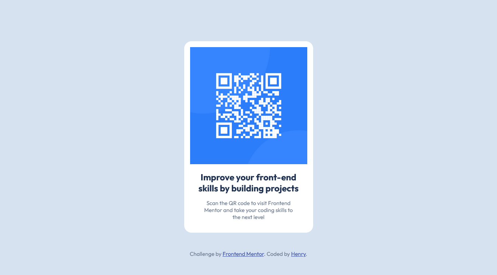

# Frontend Mentor - QR code component solution

This is a solution to the [QR code component challenge on Frontend Mentor](https://www.frontendmentor.io/challenges/qr-code-component-iux_sIO_H).  

## Table of contents

- [Overview](#overview)
  - [Screenshot](#screenshot)
  - [Links](#links)
- [My process](#my-process)
  - [Built with](#built-with)
  - [What I learned](#what-i-learned)
  - [Continued development](#continued-development)
  - [Useful resources](#useful-resources)
- [Author](#author)

## Overview

### Screenshot



### Links

- Solution URL: [https://github.com/Henrydevlab/qr-code-component](https://github.com/Henrydevlab/qr-code-component)
- Live Site URL: [https://henrydevlab.github.io/qr-code-component/](https://henrydevlab.github.io/qr-code-component/)

## My process

### Built with

- Semantic HTML5 markup
- CSS custom properties
- Flexbox
- CSS Grid
- Mobile-first workflow
- Relative units (`rem`, `%`, `vh`)

### What I learned

This project was a great exercise in applying modern CSS layout techniques for perfect centering and ensuring responsiveness, even on a small component.

#### 1. Perfect Centering with Flexbox

I successfully used Flexbox on the `<body>` element to center the component vertically and horizontally, ensuring it stays centered regardless of the viewport size.

```css
body {
  /* ... other styles */
  display: flex;
  flex-direction: column;
  justify-content: center; /* Centers vertically */
  align-items: center;    /* Centers horizontally */
  min-height: 100vh;      /* Ensures body takes up full viewport height */
  padding: 1.5rem;        /* Safety padding for small viewports */
}

```
#### 2. Using CSS Custom Properties

Defining all design variables in a :root block made the colors and typography easily manageable and consistent across the stylesheet.

```css
:root {
  /* Colors */
  --color-white: hsl(0, 0%, 100%);
  --color-slate-900: hsl(218, 44%, 22%);

  /* Typography */
  --font-family-outfit: 'Outfit', sans-serif;
}
```
### Continued development

I want to continue focusing on:

- Accessibility (A11y): Ensuring all projects meet high WCAG standards, particularly focusing on keyboard navigation and ARIA attributes in more complex components.

- CSS Logical Properties: Exploring and adopting CSS logical properties (like padding-inline, margin-block) to future-proof my projects for internationalization.

### Useful resources

- [A Complete Guide to Flexbox (CSS-Tricks)](https://css-tricks.com/snippets/css/a-guide-to-flexbox/) - This resource was invaluable for quickly implementing the perfect vertical and horizontal centering of the card component.
- [MDN Web Docs - CSS Custom Properties](https://developer.mozilla.org/en-US/docs/Web/CSS/Using_CSS_custom_properties) - Helped reinforce the use of CSS variables for clean, maintainable color and font definitions.
- [The Markdown Guide](https://www.markdownguide.org/) - Used as a quick reference for formatting the code snippets and structure within this README file.

## Author

- Frontend Mentor - [@henrydevlab](https://www.frontendmentor.io/profile/Henrydevlab)
- Twitter - [@henrydvlab](https://x.com/henrydevlab)